<p align="center">
  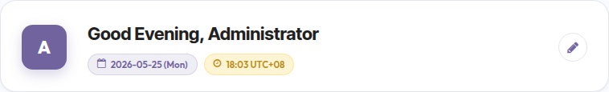
</p>

<h1 align="center">Woow Odoo Portal User UI</h1>

<p align="center">
  <strong>Clean, Modern Portal Experience for Odoo 18</strong><br/>
  Redesigned home dashboard, unified notification center, WoowTech-styled portal pages, and responsive design
</p>

<p align="center">
  <a href="#features">Features</a> &bull;
  <a href="#architecture">Architecture</a> &bull;
  <a href="#installation">Installation</a> &bull;
  <a href="#screenshots">Screenshots</a> &bull;
  <a href="#configuration">Configuration</a> &bull;
  <a href="#testing">Testing</a> &bull;
  <a href="README_zh-TW.md">中文文件</a>
</p>

<p align="center">
  
  
  
  
  
</p>

---

## Overview

**Woow Portal UI** is a single-module Odoo 18 addon that completely overhauls the portal user experience. It restyles all portal pages with the WoowTech brand design, features a clean dashboard with time-based greetings, a unified notification center, card-based layouts for all list and detail pages, responsive mobile design with collapsible filter panels, and intelligent role-based UI separation between internal and portal users.

<p align="center">
  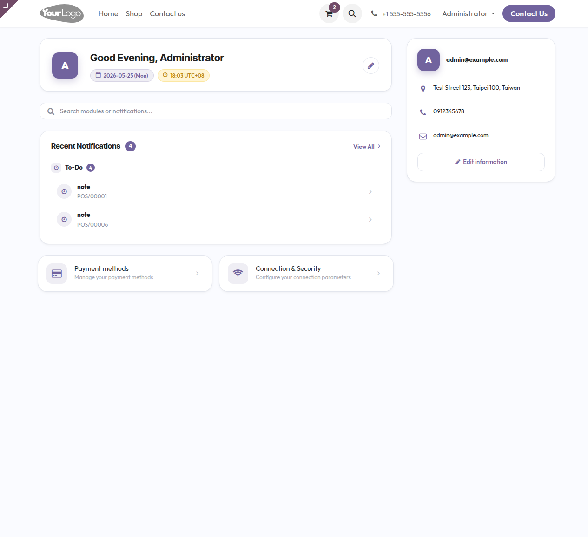
</p>

### Why This Module?

| Problem | Solution |
|---------|----------|
| Default Odoo portal is cluttered and unintuitive | Clean dashboard with greeting card, search bar, and organized module cards |
| Notifications, messages, and activities are scattered | Unified notification center with 4-tab navigation and badge counts |
| No quick-action capability on notifications | Swipe right to mark read (notifications) or complete (activities) |
| Portal and internal users see identical UI | Role-based isolation — portal users see 3 tabs, internal users see 4 |
| No way to filter/search notifications | Full filter (All/Unread/Read), sort (Newest/Oldest), group (Type/Source) panel |
| Zero-count modules waste screen space | Automatically hidden when count is 0 |

---

## Features

### Portal Home Dashboard
- **Time-based greeting card** — Displays "Good morning/afternoon/evening" with user avatar, name, and current date/time with timezone
- **Module search bar** — Real-time case-insensitive filtering of portal module cards
- **Smart module cards** — Zero-count modules automatically hidden; only relevant modules displayed
- **Notification preview card** — At-a-glance summary of unread messages, notifications, and activities with "View All" links
- **Logo rewrite** — Company logo links to `/my/home` instead of `/web` or `/`
- **White navbar** — Clean white background for the portal navigation bar
- **Footer hidden** — Removes the default Odoo footer for a cleaner look

### Unified Notification Center
- **4-tab navigation** (internal users) — All / Messages / Notifications / Activities
- **3-tab navigation** (portal users) — All / Messages / Notifications (no Activity tab)
- **Dynamic badge counts** — All badge = unread notifications + pending activities; Activity badge = pending count
- **Activity separation** — Activities use orange border styling, distinct from read/unread notification states
- **URL tab parameter** — Direct access via `?tab=message`, `?tab=notification`, `?tab=activity`

### Search, Filter, Sort & Group
- **Real-time search** — Debounced text search across notification titles with `keyup` event handling
- **Filter buttons** — All / Unread / Read filter with instant card visibility toggling
- **Sort buttons** — Newest first / Oldest first with DOM reordering
- **Group buttons** — None / By Type / By Source with dynamic group headers
- **Combined operations** — Filter + Group work together (e.g., "Unread grouped by Type")
- **XSS safe** — Special characters in search do not cause errors or injection

### Swipe-to-Action Gestures
- **Swipe right on notifications** — Marks as read (blue background hint: `rgb(97, 131, 252)`)
- **Swipe right on activities** — Marks as done (green background hint: `rgb(140, 211, 127)`)
- **100px threshold** — Swipes below 100px snap back; above 100px trigger the action
- **Desktop mouse support** — Full mouse drag support in addition to touch events
- **Visual swipe hint** — "Swipe right to mark as read / done" indicator

### Click-to-Detail Modal
- **Notification modal** — Shows full notification details with "Mark Read" button
- **Activity modal** — Shows activity details with "Done" button and document link
- **Close methods** — Escape key, close button, or overlay click
- **Badge updates** — Real-time badge count updates after modal actions

### Unread Dot Toggle
- **Click to toggle** — Click the dot on a notification to toggle read/unread state
- **Event isolation** — Dot click does not propagate to open the modal
- **Activity exclusion** — Activity cards do not have dot toggles (separate paradigm)

### Mark All Read
- **Scope** — Only marks notifications as read; activities are unaffected
- **Badge update** — All badge updates to show only remaining activity count
- **Completion state** — Button shows "Completed" then hides after action
- **Dot cleanup** — All unread dots hidden after mark all read

### Role-Based UI Isolation
- **Portal users** — 3 tabs only (no Activity tab), no activity badges, own notifications only
- **Internal users** — Full 4-tab experience with activities, all notifications
- **Data isolation** — Each user only sees their own notifications (enforced server-side)

### Backend-to-Portal Switch
- **Quick switch** — Backend users can quickly navigate to the portal view via a dedicated button
- **Seamless transition** — Maintains user session across the switch

### Portal Page Styling
- **WoowTech design** — Restyle all portal pages with WoowTech brand identity (Blue #6183fc)
- **RWD** — Responsive Web Design for all portal pages with mobile-optimized layouts
- **Card-based layout** — Clean card-based layout across all portal pages

#### Styled Pages

| Page | List | Detail |
|------|------|--------|
| Sales Orders / Quotations | Card grid with hover effects | Sidebar + main content card, info grid, "Next Step" action card |
| Invoices | Card grid with status badges | Sidebar with payment info, styled table |
| Tasks | Card grid | Card-based detail with sidebar |
| Timesheets | Card grid | — |
| Projects | Card grid | — |
| Opportunities / Leads | Card grid | Card layout with sidebar |
| Purchase Orders | Card grid | Card layout with sidebar |
| Account Details | Styled form | — |
| Security | Card-based sections | — |
| Payment Methods | Styled form | Availability report card |
| Notification Center | 2-column layout | — |

---

## Architecture

### System Overview

```
┌─────────────────────────────────────────────────────────────────┐
│                      Woow Portal UI                              │
├─────────────────────────────────────────────────────────────────┤
│                                                                  │
│  Frontend (Browser)                                              │
│  ┌────────────────────────────────────────────────────────────┐  │
│  │  portal.js (1026 lines)              portal.css (625 lines)│  │
│  │                                                            │  │
│  │  • Tab Navigation Engine      • Responsive Card Layout     │  │
│  │  • Swipe Gesture Handler      • Activity Orange Borders    │  │
│  │  • Modal Manager              • Swipe Hint Animations      │  │
│  │  • Search/Filter/Sort/Group   • Tab Badge Styling          │  │
│  │  • Unread Dot Toggle          • Modal Overlay              │  │
│  │  • Mark All Read Handler      • Navbar White Theme         │  │
│  │  • Badge Count Updater        • Zero-count Card Hiding     │  │
│  │  • Module Search Filter       • Footer Removal             │  │
│  └────────────────────────────────────────────────────────────┘  │
│                           │  JSON-RPC                            │
│                           ▼                                      │
│  Backend (Python)                                                │
│  ┌────────────────────────────────────────────────────────────┐  │
│  │  portal.py (700 lines)                                     │  │
│  │                                                            │  │
│  │  Routes:                                                   │  │
│  │  • GET  /my/home           → Portal Home Dashboard         │  │
│  │  • GET  /my/notifications  → Notification Center           │  │
│  │  • POST /my/notification/toggle_read → Toggle Read/Unread  │  │
│  │  • POST /my/notification/mark_read   → Mark Single Read    │  │
│  │  • POST /my/notification/mark_all_read → Mark All Read     │  │
│  │  • POST /my/activity/done           → Complete Activity    │  │
│  │                                                            │  │
│  │  Data Assembly:                                            │  │
│  │  • Notification aggregation (mail.message + bus.bus)        │  │
│  │  • Activity collection (mail.activity)                     │  │
│  │  • User role detection (internal vs portal)                │  │
│  │  • Module card counting with zero-filter                   │  │
│  └────────────────────────────────────────────────────────────┘  │
│                           │                                      │
│  Templates (QWeb XML)                                            │
│  ┌────────────────────────────────────────────────────────────┐  │
│  │  portal_templates.xml (515 lines)                          │  │
│  │                                                            │  │
│  │  • Portal Home override (greeting, search, preview, cards) │  │
│  │  • Notification Center page (tabs, filter bar, card list)  │  │
│  │  • Detail Modal (overlay, title, body, actions)            │  │
│  │  • Swipe hint overlay                                      │  │
│  │  • Navbar & breadcrumb overrides                           │  │
│  └────────────────────────────────────────────────────────────┘  │
│                                                                  │
├──────────────────────────────────────────────────────────────────┤
│                    Odoo 18 Framework                              │
│  portal │ mail │ mail.message │ mail.activity │ bus.bus           │
├──────────────────────────────────────────────────────────────────┤
│                    PostgreSQL Database                            │
└─────────────────────────────────────────────────────────────────┘
```

### Module Dependency Graph

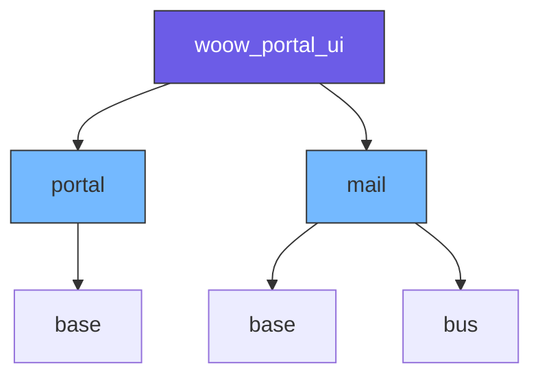
```mermaid
graph TD
    A[woow_portal_ui] --> B[portal]
    A --> C[mail]
    B --> D[base]
    C --> E[base]
    C --> F[bus]

    style A fill:#6C5CE7,color:#fff,stroke:#333
    style B fill:#74b9ff,color:#333,stroke:#333
    style C fill:#74b9ff,color:#333,stroke:#333
```

### Data Flow — Notification Lifecycle

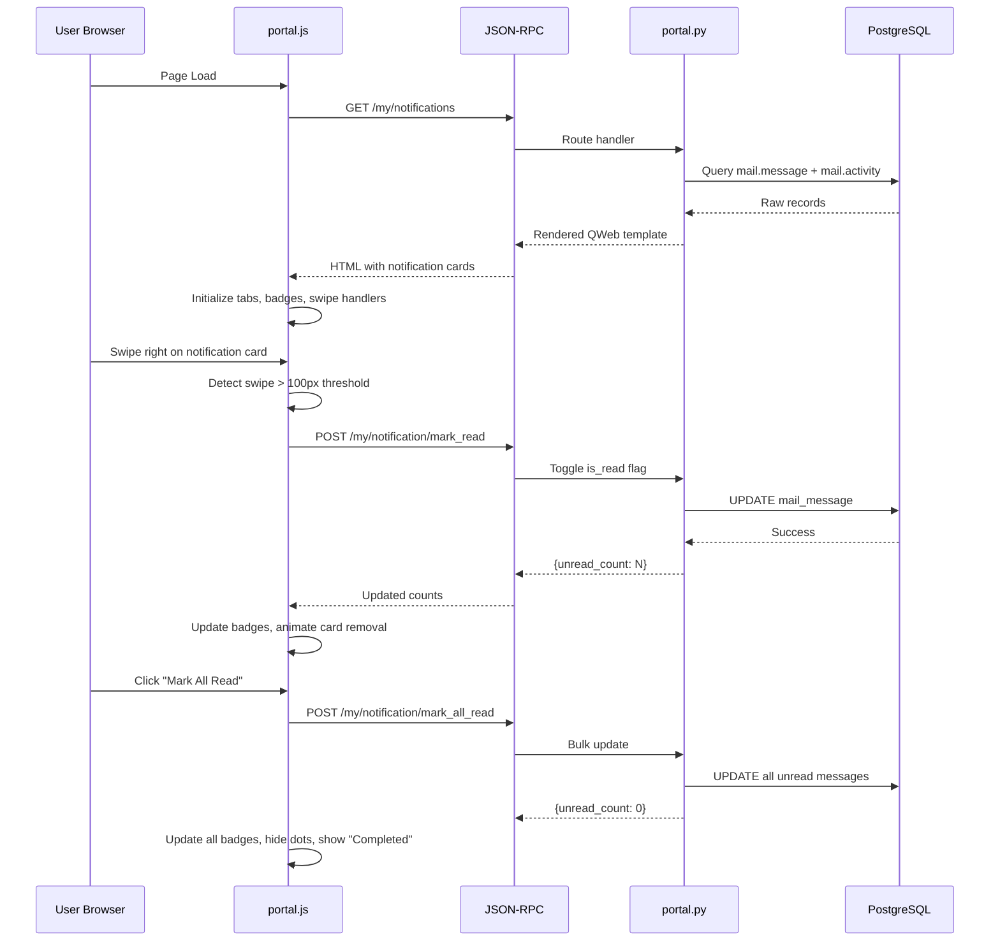
```mermaid
sequenceDiagram
    participant U as User Browser
    participant JS as portal.js
    participant RPC as JSON-RPC
    participant PY as portal.py
    participant DB as PostgreSQL

    U->>JS: Page Load
    JS->>RPC: GET /my/notifications
    RPC->>PY: Route handler
    PY->>DB: Query mail.message + mail.activity
    DB-->>PY: Raw records
    PY-->>RPC: Rendered QWeb template
    RPC-->>JS: HTML with notification cards
    JS->>JS: Initialize tabs, badges, swipe handlers

    U->>JS: Swipe right on notification card
    JS->>JS: Detect swipe > 100px threshold
    JS->>RPC: POST /my/notification/mark_read
    RPC->>PY: Toggle is_read flag
    PY->>DB: UPDATE mail_message
    DB-->>PY: Success
    PY-->>RPC: {unread_count: N}
    RPC-->>JS: Updated counts
    JS->>JS: Update badges, animate card removal

    U->>JS: Click "Mark All Read"
    JS->>RPC: POST /my/notification/mark_all_read
    RPC->>PY: Bulk update
    PY->>DB: UPDATE all unread messages
    PY-->>RPC: {unread_count: 0}
    JS->>JS: Update all badges, hide dots, show "Completed"
```

### File Structure

```
woow_portal_ui/
├── __init__.py
├── __manifest__.py
├── controllers/
│   ├── __init__.py
│   └── portal.py              # 700 lines — All route handlers & data assembly
├── models/
│   ├── __init__.py
│   └── ir_http.py              # CDN/asset model extension
├── views/
│   └── portal_templates.xml    # 515 lines — QWeb templates
├── static/
│   ├── src/
│   │   ├── js/
│   │   │   ├── portal.js       # 1026 lines — Frontend logic
│   │   │   └── switch_portal.js # Backend-to-portal switch
│   │   └── css/
│   │       ├── portal.css          # Notification center & functional styles
│   │       ├── woowtech_theme.css  # WoowTech brand design system
│   │       ├── detail_pages.css    # Detail page card layouts
│   │       └── chatter_theme.css   # Messaging/chatter theme
│   └── description/
│       └── icon.png
├── security/
│   └── ir.model.access.csv
└── i18n/
    └── zh_TW.po                # Traditional Chinese translation
```

---

## Installation

### Prerequisites
- Odoo 18.0 (Community or Enterprise)
- Python 3.10+
- PostgreSQL 13+

### Steps

1. **Clone the repository**
   ```bash
   git clone https://github.com/WOOWTECH/Woow_odoo_portal_user_ui.git
   ```

2. **Copy the module to your Odoo addons directory**
   ```bash
   cp -r Woow_odoo_portal_user_ui/woow_portal_ui /path/to/odoo/addons/
   ```

3. **Update the module list**
   ```
   Settings → Technical → Update Apps List
   ```

4. **Install the module**
   ```
   Search for "Woow Portal UI" → Install
   ```

### Docker Deployment

```yaml
version: '3.8'
services:
  web:
    image: odoo:18.0
    ports:
      - "8069:8069"
    volumes:
      - ./woow_portal_ui:/mnt/extra-addons/woow_portal_ui
    environment:
      - HOST=db
      - USER=odoo
      - PASSWORD=odoo
    depends_on:
      - db
  db:
    image: postgres:16
    environment:
      - POSTGRES_DB=postgres
      - POSTGRES_USER=odoo
      - POSTGRES_PASSWORD=odoo
```

---

## Screenshots

### Portal Home — Internal User
The redesigned portal home features a time-based greeting card with user avatar, a search bar for filtering module cards, and a notification preview summary.

<p align="center">
  
</p>

### Greeting Card
Time-aware greeting (morning/afternoon/evening) with user avatar and current date/time display.

<p align="center">
  
</p>

### Notification Center — All Tab
Unified view of all notifications, messages, and activities with badge counts. Unread notifications and pending activities contribute to the "All" badge.

<p align="center">
  
</p>

### Message Tab
Filtered view showing only comment/email messages, excluding system notifications and activities.

<p align="center">
  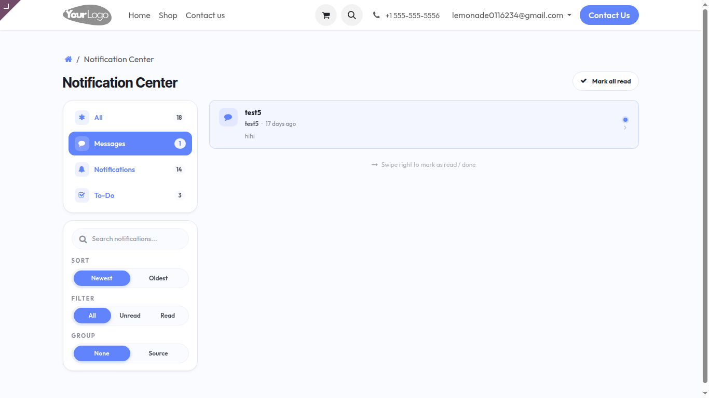
</p>

### Notification Tab
System notifications (assignment, status changes, etc.) displayed separately from messages and activities.

<p align="center">
  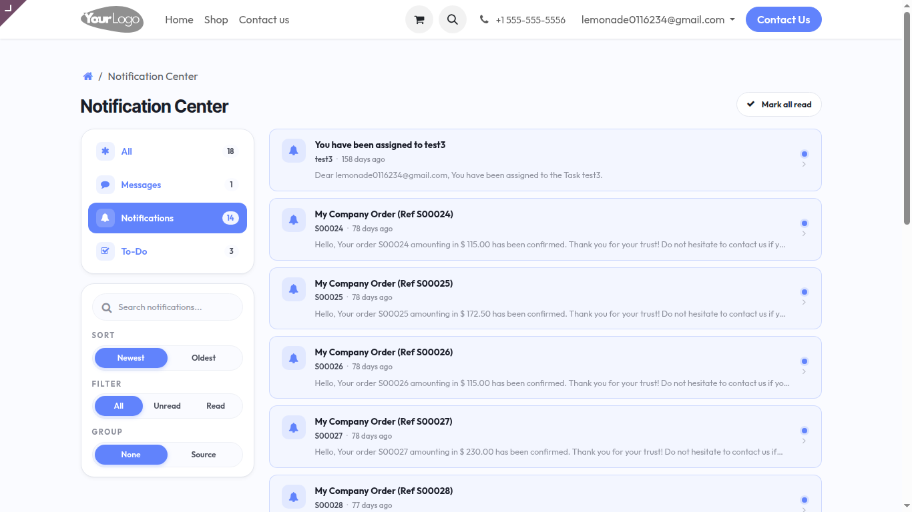
</p>

### Activity Tab (Internal Users Only)
Pending activities with orange border styling, "Done" button, and document links. This tab is hidden for portal users.

<p align="center">
  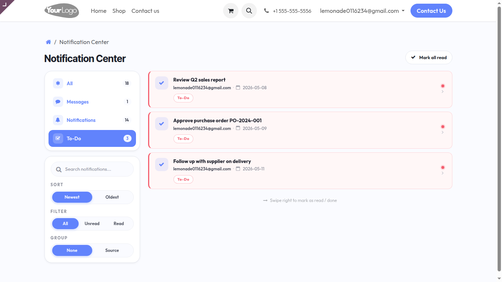
</p>

### Filter / Sort / Group Panel
Toolbar with filter (All/Unread/Read), sort (Newest/Oldest), and group (None/Type/Source) buttons.

<p align="center">
  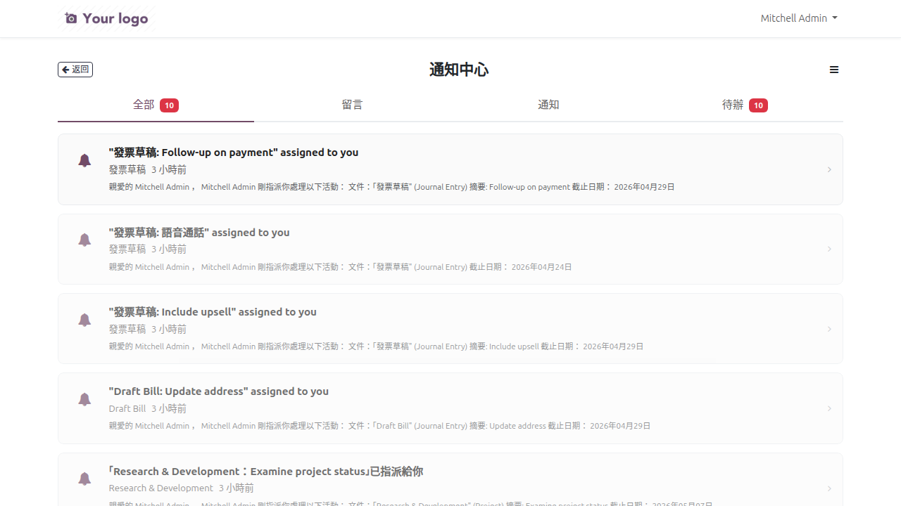
</p>

### Detail Modal — Notification
Click any notification card to open a detail modal with full content, mark-read button, and document link.

<p align="center">
  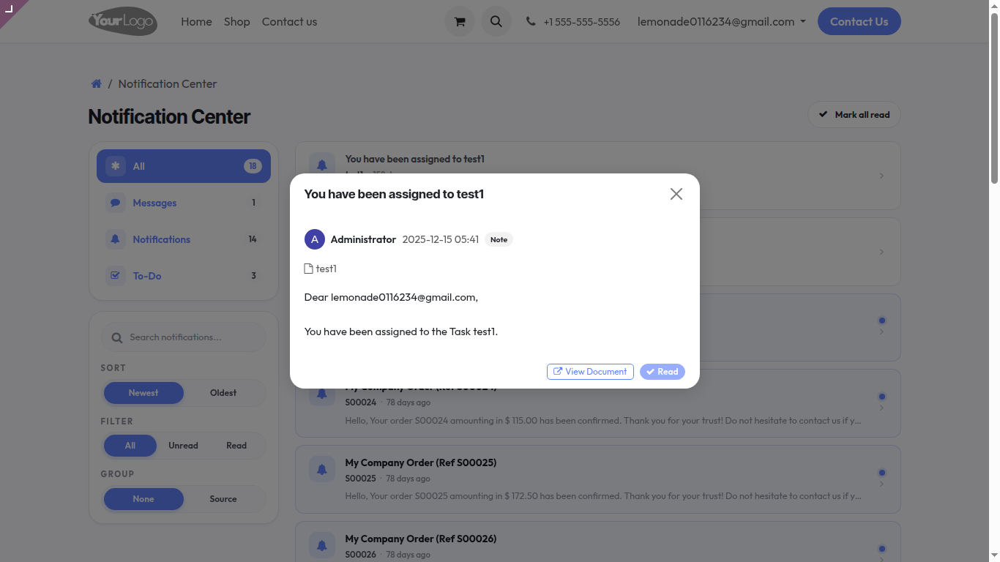
</p>

### Detail Modal — Activity
Activity detail modal with "Done" button, activity type badge, and link to the source document.

<p align="center">
  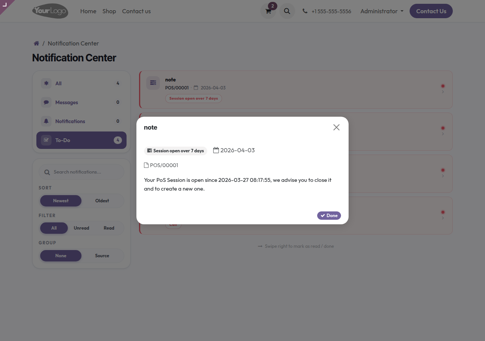
</p>

### Portal User — Home
Portal users see the same clean dashboard but without internal-only features (e.g., Activity tab).

<p align="center">
  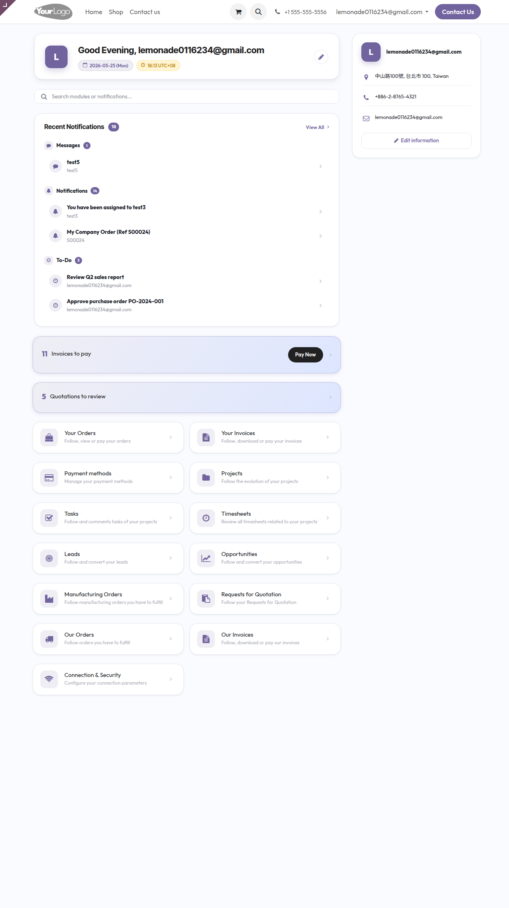
</p>

### Portal User — Notification Center
Portal users see 3 tabs (All / Messages / Notifications) with no Activity tab or activity badge.

<p align="center">
  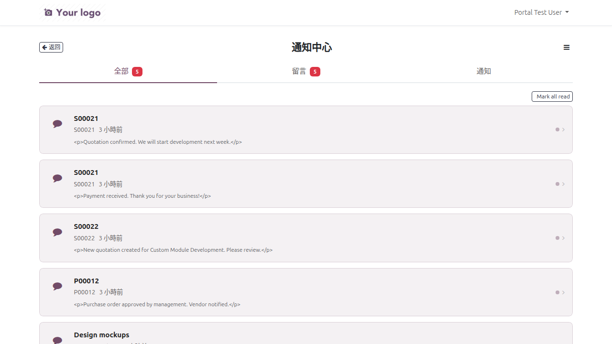
</p>

### Module Search
Real-time search filtering on the portal home page — type to instantly filter module cards.

<p align="center">
  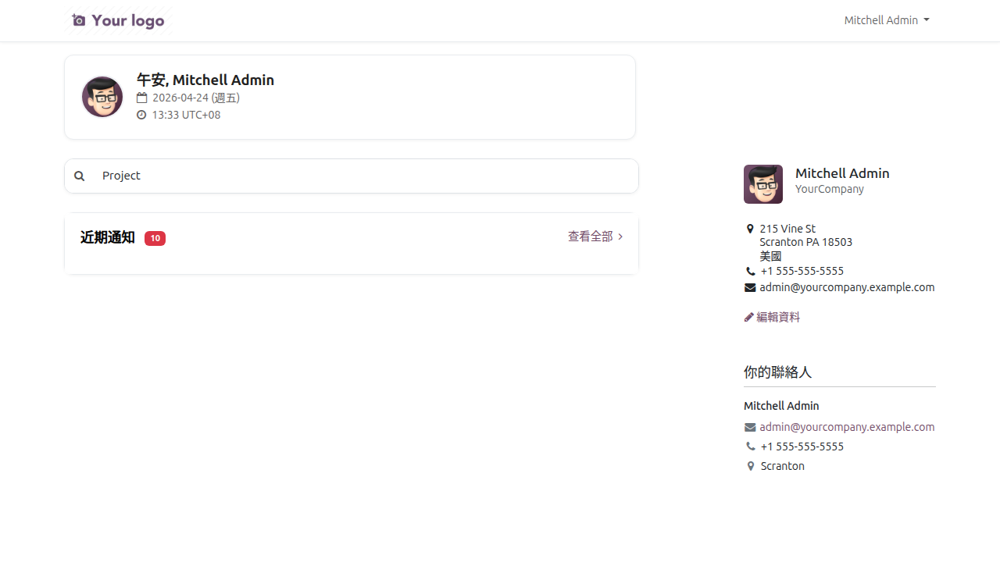
</p>

### Portal Page Styling

#### Sales Orders List
Card-based grid layout with hover effects and status indicators.

<p align="center">
  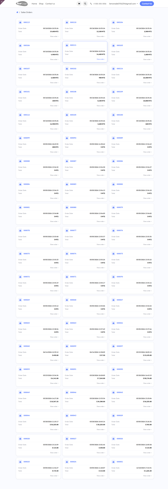
</p>

#### Sale Order Detail
Sidebar card with price and actions, main content card with info grid and styled table.

<p align="center">
  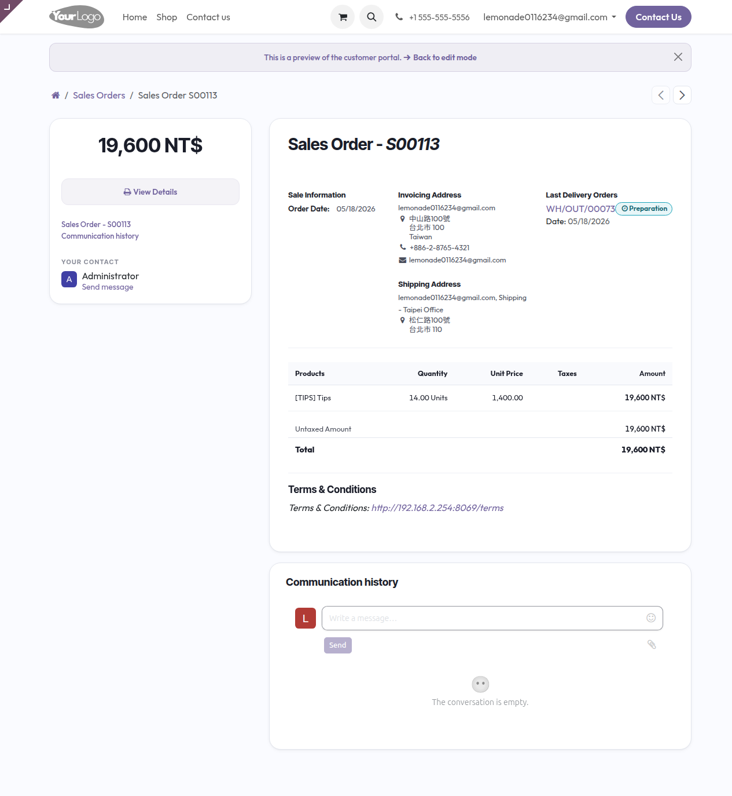
</p>

#### Quotation Detail — Next Step Card
Action card with dynamic text and pill-shaped buttons (Sign & Pay / Feedback / Reject).

<p align="center">
  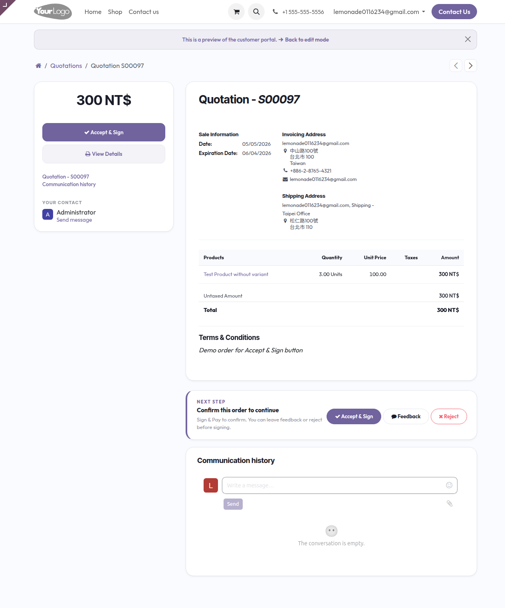
</p>

#### Invoices List
<p align="center">
  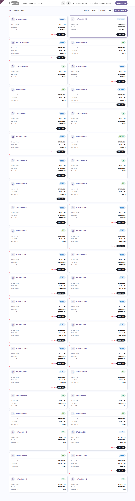
</p>

#### Tasks List
Card grid with pill-shaped search bar, separated filter toggle, and styled dropdowns.

<p align="center">
  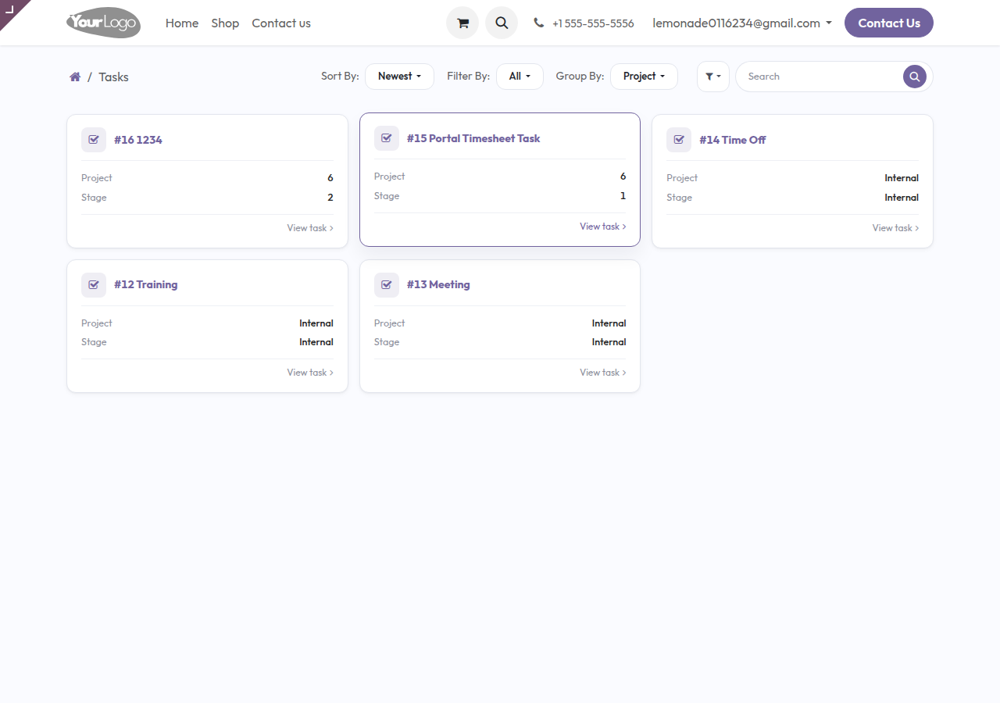
</p>

#### Opportunities List
<p align="center">
  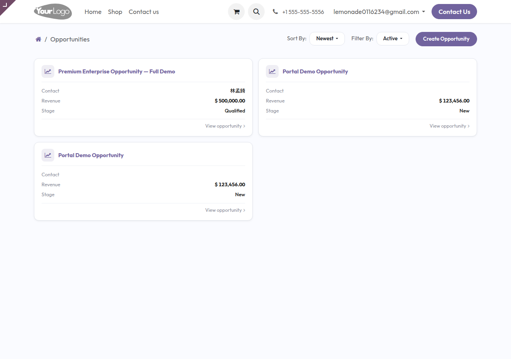
</p>

#### Security Page
<p align="center">
  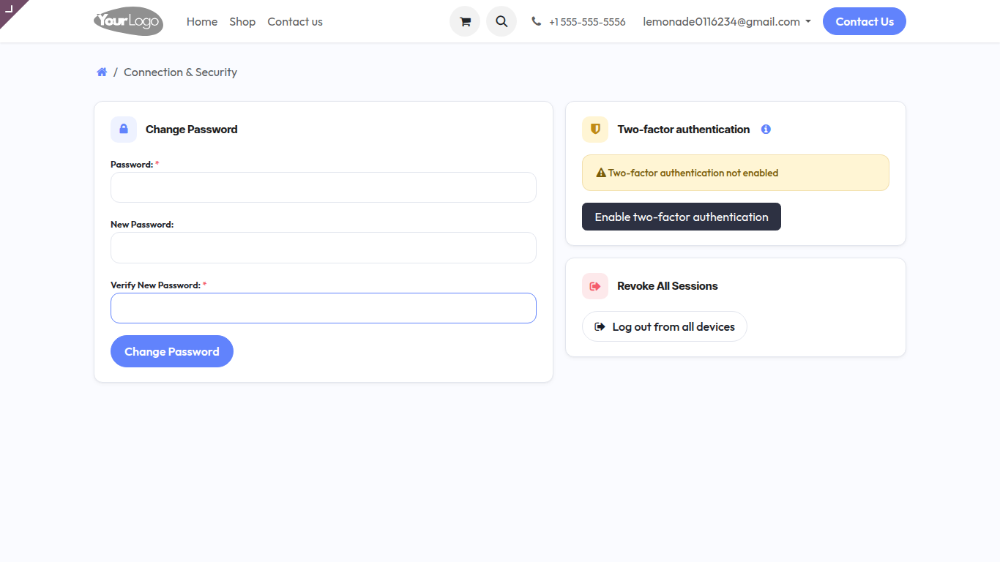
</p>

#### Mobile — Tasks List with Filter Panel
Collapsible filter panel with NC-style segmented buttons and scroll hints.

<p align="center">
  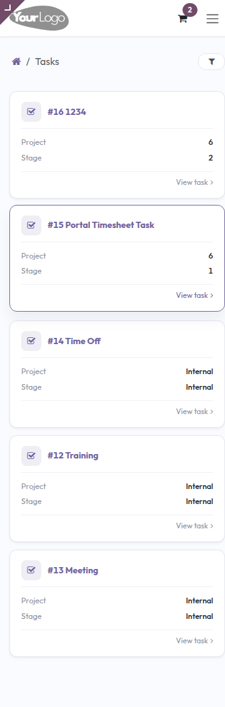
</p>

#### Mobile — Sale Order Detail
Responsive card layout with full-width action buttons.

<p align="center">
  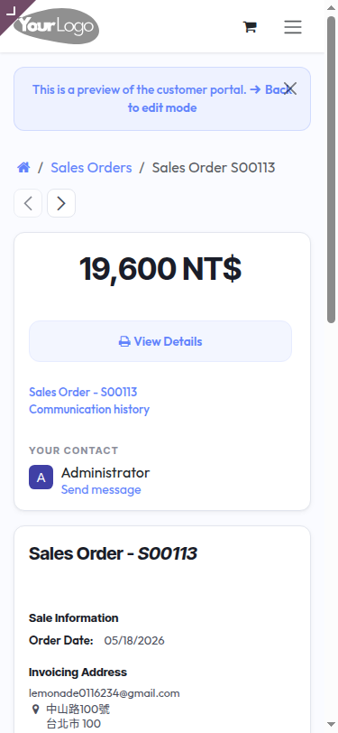
</p>

---

## Configuration

### No Configuration Required
This module works out of the box after installation. All features are automatically enabled for all portal and internal users.

### Customization Points

| Setting | Location | Default |
|---------|----------|---------|
| Greeting timezone | Server timezone (UTC+08 shown) | Server default |
| Module card visibility | Automatic based on record count | Hide when count = 0 |
| Activity tab visibility | Automatic based on user type | Internal only |
| Swipe threshold | `portal.js` constant `SWIPE_THRESHOLD` | 100px |
| Search debounce | `portal.js` debounce timer | 300ms |

---

## Testing

### Test Suite
This module has been comprehensively tested with **87 automated tests** across 10 phases using Playwright browser automation.

| Phase | Scope | Tests | Result |
|-------|-------|-------|--------|
| Phase 1 | Portal Home | 13 | 13/13 PASS |
| Phase 2 | Tabs & Badges | 10 | 10/10 PASS |
| Phase 3 | Search/Filter/Sort/Group | 12 | 12/12 PASS |
| Phase 4 | Swipe Gestures | 7 | 7/7 PASS |
| Phase 5 | Detail Modal | 10 | 10/10 PASS |
| Phase 6 | Unread Dot Toggle | 7 | 7/7 PASS |
| Phase 7 | Mark All Read | 8 | 8/8 PASS |
| Phase 8 | Portal User Isolation | 10 | 10/10 PASS |
| Phase 9 | UI/UX Elements | 10 | 10/10 PASS |
| Phase 10 | Edge Cases | 10 | 10/10 PASS |
| **Total** | | **87** | **87/87 PASS (100%)** |

### Key Test Coverage
- **Functional**: All CRUD operations on notifications and activities
- **UI/UX**: Greeting card, navbar, footer, tab styling, cursor behavior
- **Interaction**: Swipe gestures, modal open/close, dot toggle, search filtering
- **Security**: XSS prevention in search, data isolation between users
- **Edge Cases**: Rapid tab switching, double-click protection, empty/no-match search, special characters
- **Role Isolation**: Portal vs. internal user feature separation

---

## API Reference

### Routes

| Method | Endpoint | Description |
|--------|----------|-------------|
| `GET` | `/my/home` | Portal home dashboard |
| `GET` | `/my/notifications` | Notification center (accepts `?tab=all\|message\|notification\|activity`) |
| `POST` | `/my/notification/toggle_read` | Toggle read/unread state for a notification |
| `POST` | `/my/notification/mark_read` | Mark a single notification as read |
| `POST` | `/my/notification/mark_all_read` | Mark all notifications as read |
| `POST` | `/my/activity/done` | Complete an activity |

### JavaScript Events

| Event | Trigger | Handler |
|-------|---------|---------|
| `keyup` on `#wpu_module_search` | Portal home search | Filters module cards in real-time |
| `keyup` on `#wpu_notif_search_input` | Notification search | Filters notification cards with debounce |
| `click` on `.wpu-notif-tab` | Tab click | Switches active tab and visible cards |
| `mousedown/touchstart` on `.wpu-notif-card` | Swipe start | Initiates swipe gesture tracking |
| `click` on `.wpu-unread-dot` | Dot click | Toggles read/unread via JSON-RPC |
| `click` on `#wpu_mark_all_read` | Mark All button | Bulk marks all notifications as read |

---

## Security

- **Server-side data isolation** — Each user only sees their own notifications (enforced in Python controller)
- **Role-based UI** — Activity tab and badge hidden for portal users (enforced in both QWeb template and controller)
- **XSS prevention** — Search inputs are safely handled; special characters do not cause injection
- **CSRF protection** — All POST routes use Odoo's built-in CSRF token validation
- **No external dependencies** — Pure Odoo module with no third-party JavaScript libraries

---

## Changelog

### v18.0.1.1.0 (2026-05)
- Restyle all portal pages with WoowTech brand design
- RWD (Responsive Web Design) for all portal pages
- Card-based layout for list and detail pages
- Pill-shaped search bar with separated filter toggle
- Mobile collapsible filter panel with segmented buttons
- "Next Step" action card on quotation pages with dynamic text
- Portal alert messages styled with brand color tints
- Form focus/hover borders use brand blue
- Standard portal breadcrumb on Notification Center page
- Create Opportunity / Pay overdue buttons styled as pills
- Payment availability report styled as card
- Mobile-optimized card margins and button layouts

### v18.0.1.0.0 (2026-04)
- Initial release
- Portal home dashboard with greeting card, search bar, notification preview
- Unified notification center with 4-tab navigation
- Swipe-to-action gestures (mark read / complete activity)
- Click-to-detail modal
- Unread dot toggle
- Mark all read
- Filter / Sort / Group panel
- Portal user isolation (3 tabs, no activities)
- Backend-to-portal switch button
- Traditional Chinese (zh_TW) translation
- 87 automated Playwright tests (100% pass rate)

---

## License

This module is licensed under [LGPL-3](https://www.gnu.org/licenses/lgpl-3.0.html).

---

<p align="center">
  <strong>Built by <a href="https://www.woow.tw">Woow Tech</a></strong>
</p>
