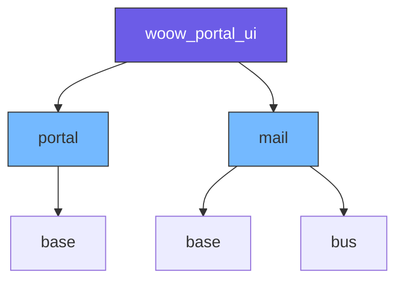
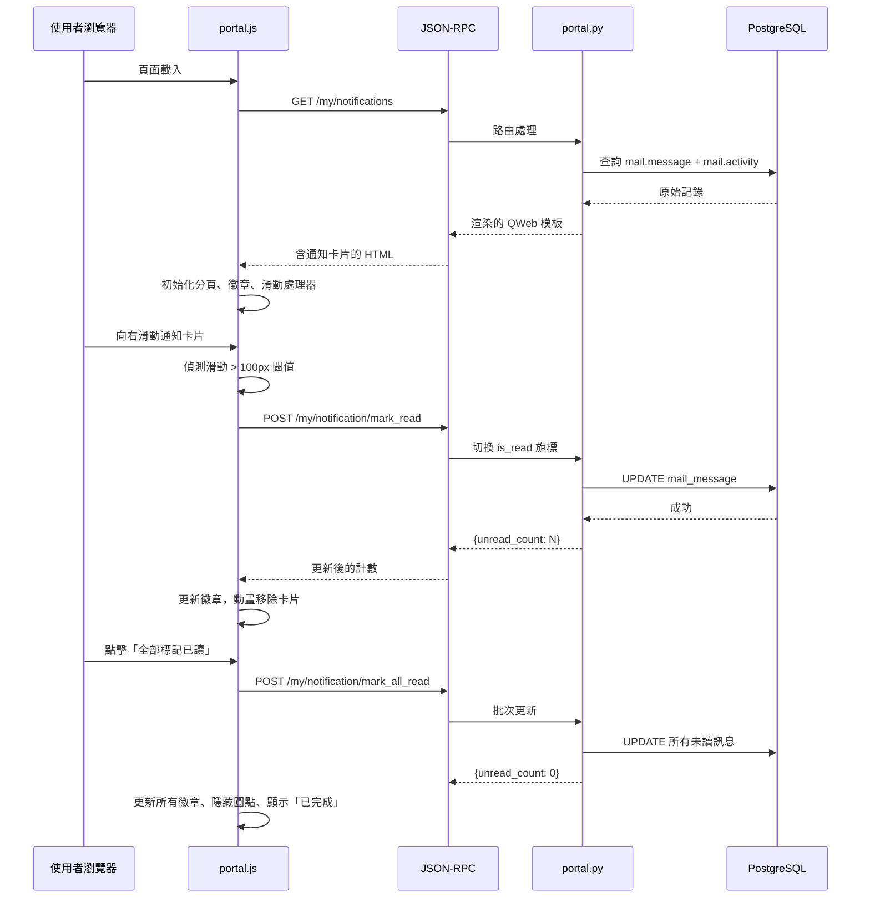

<p align="center">
  
</p>

<h1 align="center">Woow Odoo 入口網站使用者介面</h1>

<p align="center">
  <strong>Odoo 18 全新清爽入口網站體驗</strong><br/>
  重新設計的首頁儀表板、統一通知中心、WoowTech 品牌風格入口頁面、響應式設計
</p>

<p align="center">
  <a href="#功能特色">功能特色</a> &bull;
  <a href="#系統架構">系統架構</a> &bull;
  <a href="#安裝說明">安裝說明</a> &bull;
  <a href="#功能截圖">功能截圖</a> &bull;
  <a href="#設定說明">設定說明</a> &bull;
  <a href="#測試報告">測試報告</a> &bull;
  <a href="README.md">English</a>
</p>

<p align="center">
  
  
  
  
  
</p>

---

## 概述

**Woow Portal UI** 是一個 Odoo 18 單模組附加套件，全面翻新入口網站的使用者體驗。以 WoowTech 品牌風格重新設計所有入口頁面，採用卡片式佈局，搭配乾淨的儀表板、統一通知中心、響應式手機端設計含可收合篩選面板，以及內部使用者與入口網站使用者的智慧角色 UI 隔離。

<p align="center">
  
</p>

### 為什麼選擇此模組？

| 痛點問題 | 解決方案 |
|----------|----------|
| 預設 Odoo 入口網站介面雜亂 | 乾淨的儀表板：問候卡片、搜尋列、有組織的模組卡片 |
| 通知、留言、待辦散落各處 | 統一通知中心，4 分頁導航搭配徽章計數 |
| 通知沒有快速操作功能 | 向右滑動即可標記已讀（通知）或完成（待辦） |
| 入口網站和內部使用者看到相同 UI | 角色隔離 — 入口網站使用者 3 分頁，內部使用者 4 分頁 |
| 無法篩選或搜尋通知 | 完整篩選（全部/未讀/已讀）、排序（最新/最舊）、分組（類型/來源）面板 |
| 零計數的模組佔據螢幕空間 | 計數為 0 時自動隱藏 |

---

## 功能特色

### 入口網站首頁儀表板
- **時段問候卡片** — 根據時間顯示「早安/午安/晚安」，搭配使用者頭像、姓名及當前日期時間（含時區）
- **模組搜尋列** — 即時不分大小寫篩選入口網站模組卡片
- **智慧模組卡片** — 零計數模組自動隱藏，只顯示有資料的模組
- **通知預覽卡片** — 一覽未讀留言、通知和待辦活動摘要，含「查看全部」連結
- **Logo 連結改寫** — 公司 Logo 連結至 `/my/home` 而非 `/web` 或 `/`
- **白色導航列** — 入口網站導航列採用乾淨的白色背景
- **隱藏頁尾** — 移除預設 Odoo 頁尾以保持簡潔

### 統一通知中心
- **4 分頁導航**（內部使用者）— 全部 / 留言 / 通知 / 待辦
- **3 分頁導航**（入口網站使用者）— 全部 / 留言 / 通知（無待辦分頁）
- **動態徽章計數** — 全部徽章 = 未讀通知 + 待辦活動數；待辦徽章 = 待處理數量
- **待辦活動分離** — 待辦活動使用橙色邊框樣式，與已讀/未讀通知狀態明確區分
- **URL 分頁參數** — 可直接存取 `?tab=message`、`?tab=notification`、`?tab=activity`

### 搜尋、篩選、排序與分組
- **即時搜尋** — 防抖動文字搜尋，搭配 `keyup` 事件處理
- **篩選按鈕** — 全部 / 未讀 / 已讀，即時切換卡片可見性
- **排序按鈕** — 最新優先 / 最舊優先，DOM 重新排序
- **分組按鈕** — 無 / 依類型 / 依來源，動態分組標題
- **組合操作** — 篩選 + 分組可同時使用（例如「未讀依類型分組」）
- **XSS 安全** — 搜尋中的特殊字元不會造成錯誤或注入攻擊

### 滑動操作手勢
- **向右滑動通知** — 標記為已讀（藍色背景提示：`rgb(97, 131, 252)`）
- **向右滑動待辦** — 標記為完成（綠色背景提示：`rgb(140, 211, 127)`）
- **100px 閾值** — 滑動未達 100px 會回彈；超過 100px 觸發操作
- **桌面滑鼠支援** — 同時支援觸控和滑鼠拖曳事件
- **視覺滑動提示** — 「向右滑動可標記為已讀 / 已完成」指示器

### 點擊詳細 Modal
- **通知 Modal** — 顯示完整通知內容，含「標記已讀」按鈕
- **待辦 Modal** — 顯示待辦活動詳情，含「完成」按鈕及文件連結
- **關閉方式** — Escape 鍵、關閉按鈕或點擊遮罩層
- **徽章即時更新** — Modal 操作後即時更新徽章計數

### 未讀圓點切換
- **點擊切換** — 點擊通知上的圓點可切換已讀/未讀狀態
- **事件隔離** — 圓點點擊不會觸發開啟 Modal
- **待辦排除** — 待辦活動卡片沒有圓點切換功能（獨立操作範式）

### 全部標記已讀
- **作用範圍** — 只標記通知為已讀；待辦活動不受影響
- **徽章更新** — 全部徽章更新為僅顯示剩餘待辦活動數量
- **完成狀態** — 按鈕顯示「已完成」後隱藏
- **圓點清理** — 全部標記已讀後所有未讀圓點隱藏

### 角色權限 UI 隔離
- **入口網站使用者** — 僅 3 分頁（無待辦分頁）、無待辦徽章、僅顯示自己的通知
- **內部使用者** — 完整 4 分頁體驗，含待辦活動及所有通知
- **資料隔離** — 每位使用者只能看到自己的通知（伺服器端強制執行）

### 後台切換至入口網站
- **快速切換** — 後台使用者可透過專用按鈕快速導航至入口網站
- **無縫轉換** — 切換過程中保持使用者工作階段

### 入口頁面風格化
- **WoowTech 設計** — 以 WoowTech 品牌風格重新設計所有入口頁面（品牌藍 #6183fc）
- **響應式設計** — 所有入口頁面支援響應式設計，手機端最佳化佈局
- **卡片式佈局** — 所有入口頁面採用統一的卡片式佈局

#### 已風格化的頁面

| 頁面 | 列表頁 | 詳細頁 |
|------|--------|--------|
| 銷售訂單 / 報價單 | 卡片網格，懸停效果 | 側邊欄 + 主要內容卡片，資訊網格，「下一步」操作卡片 |
| 發票 | 卡片網格，狀態標籤 | 側邊欄含付款資訊，樣式化表格 |
| 任務 | 卡片網格 | 卡片式詳細頁含側邊欄 |
| 工時表 | 卡片網格 | — |
| 專案 | 卡片網格 | — |
| 商機 / 潛在客戶 | 卡片網格 | 卡片式佈局含側邊欄 |
| 採購訂單 | 卡片網格 | 卡片式佈局含側邊欄 |
| 帳戶資訊 | 樣式化表單 | — |
| 安全性 | 卡片式區塊 | — |
| 付款方式 | 樣式化表單 | 可用性報告卡片 |
| 通知中心 | 雙欄式佈局 | — |

---

## 系統架構

### 系統總覽

```
┌─────────────────────────────────────────────────────────────────┐
│                      Woow Portal UI                              │
├─────────────────────────────────────────────────────────────────┤
│                                                                  │
│  前端（瀏覽器）                                                  │
│  ┌────────────────────────────────────────────────────────────┐  │
│  │  portal.js (1026 行)              portal.css (625 行)      │  │
│  │                                                            │  │
│  │  • 分頁導航引擎            • 響應式卡片佈局                │  │
│  │  • 滑動手勢處理器          • 待辦橙色邊框                  │  │
│  │  • Modal 管理器            • 滑動提示動畫                  │  │
│  │  • 搜尋/篩選/排序/分組     • 分頁徽章樣式                 │  │
│  │  • 未讀圓點切換            • Modal 遮罩層                  │  │
│  │  • 全部已讀處理器          • 導航列白色主題                │  │
│  │  • 徽章計數更新器          • 零計數卡片隱藏                │  │
│  │  • 模組搜尋篩選            • 頁尾移除                      │  │
│  └────────────────────────────────────────────────────────────┘  │
│                           │  JSON-RPC                            │
│                           ▼                                      │
│  後端（Python）                                                  │
│  ┌────────────────────────────────────────────────────────────┐  │
│  │  portal.py (700 行)                                        │  │
│  │                                                            │  │
│  │  路由：                                                    │  │
│  │  • GET  /my/home           → 入口網站首頁儀表板            │  │
│  │  • GET  /my/notifications  → 通知中心                      │  │
│  │  • POST /my/notification/toggle_read → 切換已讀/未讀       │  │
│  │  • POST /my/notification/mark_read   → 標記單則已讀        │  │
│  │  • POST /my/notification/mark_all_read → 全部標記已讀      │  │
│  │  • POST /my/activity/done           → 完成待辦活動         │  │
│  │                                                            │  │
│  │  資料組裝：                                                │  │
│  │  • 通知聚合（mail.message + bus.bus）                      │  │
│  │  • 待辦活動收集（mail.activity）                           │  │
│  │  • 使用者角色偵測（內部 vs 入口網站）                      │  │
│  │  • 模組卡片計數與零值過濾                                  │  │
│  └────────────────────────────────────────────────────────────┘  │
│                                                                  │
│  模板（QWeb XML）                                                │
│  ┌────────────────────────────────────────────────────────────┐  │
│  │  portal_templates.xml (515 行)                             │  │
│  │                                                            │  │
│  │  • 入口網站首頁覆寫（問候、搜尋、預覽、卡片）             │  │
│  │  • 通知中心頁面（分頁、篩選列、卡片列表）                 │  │
│  │  • 詳細 Modal（遮罩層、標題、內容、操作）                  │  │
│  │  • 滑動提示覆蓋層                                          │  │
│  │  • 導航列與麵包屑覆寫                                      │  │
│  └────────────────────────────────────────────────────────────┘  │
│                                                                  │
├──────────────────────────────────────────────────────────────────┤
│                    Odoo 18 框架                                   │
│  portal │ mail │ mail.message │ mail.activity │ bus.bus           │
├──────────────────────────────────────────────────────────────────┤
│                    PostgreSQL 資料庫                               │
└─────────────────────────────────────────────────────────────────┘
```

### 模組相依性圖



### 資料流程 — 通知生命週期



### 檔案結構

```
woow_portal_ui/
├── __init__.py
├── __manifest__.py
├── controllers/
│   ├── __init__.py
│   └── portal.py              # 700 行 — 所有路由處理與資料組裝
├── models/
│   ├── __init__.py
│   └── ir_http.py              # CDN/資產模型擴充
├── views/
│   └── portal_templates.xml    # 515 行 — QWeb 模板
├── static/
│   ├── src/
│   │   ├── js/
│   │   │   ├── portal.js       # 1026 行 — 前端邏輯
│   │   │   └── switch_portal.js # 後台切換至入口網站
│   │   └── css/
│   │       ├── portal.css          # 通知中心及功能性樣式
│   │       ├── woowtech_theme.css  # WoowTech 品牌設計系統
│   │       ├── detail_pages.css    # 詳細頁卡片佈局
│   │       └── chatter_theme.css   # 訊息/聊天主題樣式
│   └── description/
│       └── icon.png
├── security/
│   └── ir.model.access.csv
└── i18n/
    └── zh_TW.po                # 繁體中文翻譯
```

---

## 安裝說明

### 系統需求
- Odoo 18.0（社區版或企業版）
- Python 3.10+
- PostgreSQL 13+

### 安裝步驟

1. **複製儲存庫**
   ```bash
   git clone https://github.com/WOOWTECH/Woow_odoo_portal_user_ui.git
   ```

2. **複製模組到 Odoo addons 目錄**
   ```bash
   cp -r Woow_odoo_portal_user_ui/woow_portal_ui /path/to/odoo/addons/
   ```

3. **更新模組列表**
   ```
   設定 → 技術 → 更新應用程式列表
   ```

4. **安裝模組**
   ```
   搜尋「Woow Portal UI」→ 安裝
   ```

### Docker 部署

```yaml
version: '3.8'
services:
  web:
    image: odoo:18.0
    ports:
      - "8069:8069"
    volumes:
      - ./woow_portal_ui:/mnt/extra-addons/woow_portal_ui
    environment:
      - HOST=db
      - USER=odoo
      - PASSWORD=odoo
    depends_on:
      - db
  db:
    image: postgres:16
    environment:
      - POSTGRES_DB=postgres
      - POSTGRES_USER=odoo
      - POSTGRES_PASSWORD=odoo
```

---

## 功能截圖

### 入口網站首頁 — 內部使用者
重新設計的入口網站首頁，包含時段問候卡片、搜尋列和通知預覽摘要。

<p align="center">
  
</p>

### 問候卡片
時段感知問候（早安/午安/晚安），搭配使用者頭像及當前日期時間顯示。

<p align="center">
  
</p>

### 通知中心 — 全部分頁
統一檢視所有通知、留言和待辦活動，含徽章計數。未讀通知和待辦活動數會計入「全部」徽章。

<p align="center">
  
</p>

### 留言分頁
篩選檢視，僅顯示留言/郵件訊息，排除系統通知和待辦活動。

<p align="center">
  
</p>

### 通知分頁
系統通知（指派、狀態變更等），與留言和待辦活動分開顯示。

<p align="center">
  
</p>

### 待辦分頁（僅內部使用者）
待處理的活動以橙色邊框樣式呈現，含「完成」按鈕和文件連結。此分頁對入口網站使用者隱藏。

<p align="center">
  
</p>

### 篩選 / 排序 / 分組面板
工具列包含篩選（全部/未讀/已讀）、排序（最新/最舊）和分組（無/類型/來源）按鈕。

<p align="center">
  
</p>

### 詳細 Modal — 通知
點擊任何通知卡片開啟詳細 Modal，含完整內容、標記已讀按鈕和文件連結。

<p align="center">
  
</p>

### 詳細 Modal — 待辦活動
待辦活動詳細 Modal，含「完成」按鈕、活動類型徽章和來源文件連結。

<p align="center">
  
</p>

### 入口網站使用者 — 首頁
入口網站使用者看到相同的乾淨儀表板，但不含內部專用功能（如待辦分頁）。

<p align="center">
  
</p>

### 入口網站使用者 — 通知中心
入口網站使用者看到 3 個分頁（全部/留言/通知），無待辦分頁和待辦徽章。

<p align="center">
  
</p>

### 模組搜尋
入口網站首頁的即時搜尋篩選 — 輸入即可立即篩選模組卡片。

<p align="center">
  
</p>

### 入口頁面風格化

#### 銷售訂單列表
卡片式網格佈局，含懸停效果和狀態指示。

<p align="center">
  
</p>

#### 銷售訂單詳細頁
側邊欄卡片含價格和操作，主要內容卡片含資訊網格和樣式化表格。

<p align="center">
  
</p>

#### 報價單詳細頁 — 下一步操作卡片
含動態文字和膠囊按鈕（簽署並付款 / 回饋 / 拒絕）的操作卡片。

<p align="center">
  
</p>

#### 發票列表
<p align="center">
  
</p>

#### 任務列表
含膠囊搜尋列、分離式篩選切換按鈕和樣式化下拉選單的卡片網格。

<p align="center">
  
</p>

#### 商機列表
<p align="center">
  
</p>

#### 安全性頁面
<p align="center">
  
</p>

#### 手機版 — 任務列表含篩選面板
可收合的篩選面板，含通知中心風格的分段按鈕和捲動提示。

<p align="center">
  
</p>

#### 手機版 — 銷售訂單詳細頁
響應式卡片佈局，含全寬操作按鈕。

<p align="center">
  
</p>

---

## 設定說明

### 無需額外設定
安裝後即可使用，所有功能自動對所有入口網站和內部使用者啟用。

### 自訂設定點

| 設定項目 | 位置 | 預設值 |
|----------|------|--------|
| 問候時區 | 伺服器時區（顯示 UTC+08） | 伺服器預設 |
| 模組卡片顯示 | 根據記錄計數自動判斷 | 計數為 0 時隱藏 |
| 待辦分頁顯示 | 根據使用者類型自動判斷 | 僅內部使用者 |
| 滑動閾值 | `portal.js` 常數 `SWIPE_THRESHOLD` | 100px |
| 搜尋防抖動 | `portal.js` 防抖動計時器 | 300ms |

---

## 測試報告

### 測試套件
此模組已通過 **87 項自動化測試**，涵蓋 10 個階段，使用 Playwright 瀏覽器自動化工具。

| 階段 | 測試範圍 | 測試數 | 結果 |
|------|---------|--------|------|
| 階段 1 | 入口網站首頁 | 13 | 13/13 通過 |
| 階段 2 | 分頁與徽章 | 10 | 10/10 通過 |
| 階段 3 | 搜尋/篩選/排序/分組 | 12 | 12/12 通過 |
| 階段 4 | 滑動手勢 | 7 | 7/7 通過 |
| 階段 5 | 詳細 Modal | 10 | 10/10 通過 |
| 階段 6 | 未讀圓點切換 | 7 | 7/7 通過 |
| 階段 7 | 全部標記已讀 | 8 | 8/8 通過 |
| 階段 8 | 入口網站使用者隔離 | 10 | 10/10 通過 |
| 階段 9 | UI/UX 元素 | 10 | 10/10 通過 |
| 階段 10 | 邊緣案例 | 10 | 10/10 通過 |
| **總計** | | **87** | **87/87 通過 (100%)** |

### 主要測試覆蓋範圍
- **功能性**：通知和待辦活動的所有 CRUD 操作
- **UI/UX**：問候卡片、導航列、頁尾、分頁樣式、游標行為
- **互動性**：滑動手勢、Modal 開關、圓點切換、搜尋篩選
- **安全性**：搜尋中的 XSS 防護、使用者間資料隔離
- **邊緣案例**：快速切換分頁、雙擊保護、空/無匹配搜尋、特殊字元
- **角色隔離**：入口網站 vs 內部使用者的功能分離

---

## API 參考

### 路由

| 方法 | 端點 | 說明 |
|------|------|------|
| `GET` | `/my/home` | 入口網站首頁儀表板 |
| `GET` | `/my/notifications` | 通知中心（支援 `?tab=all\|message\|notification\|activity`） |
| `POST` | `/my/notification/toggle_read` | 切換通知已讀/未讀狀態 |
| `POST` | `/my/notification/mark_read` | 標記單則通知為已讀 |
| `POST` | `/my/notification/mark_all_read` | 全部標記為已讀 |
| `POST` | `/my/activity/done` | 完成待辦活動 |

---

## 安全機制

- **伺服器端資料隔離** — 每位使用者只能看到自己的通知（Python 控制器強制執行）
- **角色 UI 隔離** — 待辦分頁和徽章對入口網站使用者隱藏（QWeb 模板和控制器雙重執行）
- **XSS 防護** — 搜尋輸入安全處理，特殊字元不會造成注入
- **CSRF 保護** — 所有 POST 路由使用 Odoo 內建的 CSRF Token 驗證
- **無外部相依** — 純 Odoo 模組，不使用任何第三方 JavaScript 函式庫

---

## 版本紀錄

### v18.0.1.1.0 (2026-05)
- 以 WoowTech 品牌風格重新設計所有入口頁面
- 所有入口頁面支援響應式設計（RWD）
- 列表頁和詳細頁採用卡片式佈局
- 膠囊搜尋列含分離式篩選切換按鈕
- 手機版可收合篩選面板含分段按鈕
- 報價頁「下一步」操作卡片含動態文字
- 入口提示訊息以品牌色調風格化
- 表單聚焦 / 懸停邊框使用品牌藍色
- 通知中心頁面使用標準入口麵包屑
- 建立商機 / 逾期付款按鈕風格化為膠囊按鈕
- 付款可用性報告風格化為卡片
- 手機版卡片間距和按鈕佈局最佳化

### v18.0.1.0.0 (2026-04)
- 初始版本
- 入口網站首頁儀表板：問候卡片、搜尋列、通知預覽
- 統一通知中心：4 分頁導航
- 滑動操作手勢（標記已讀 / 完成待辦）
- 點擊詳細 Modal
- 未讀圓點切換
- 全部標記已讀
- 篩選 / 排序 / 分組面板
- 入口網站使用者隔離（3 分頁、無待辦）
- 後台切換至入口網站按鈕
- 繁體中文（zh_TW）翻譯
- 87 項自動化 Playwright 測試（100% 通過率）

---

## 授權條款

本模組採用 [LGPL-3](https://www.gnu.org/licenses/lgpl-3.0.html) 授權條款。

---

<p align="center">
  <strong>由 <a href="https://www.woow.tw">Woow Tech</a> 打造</strong>
</p>
