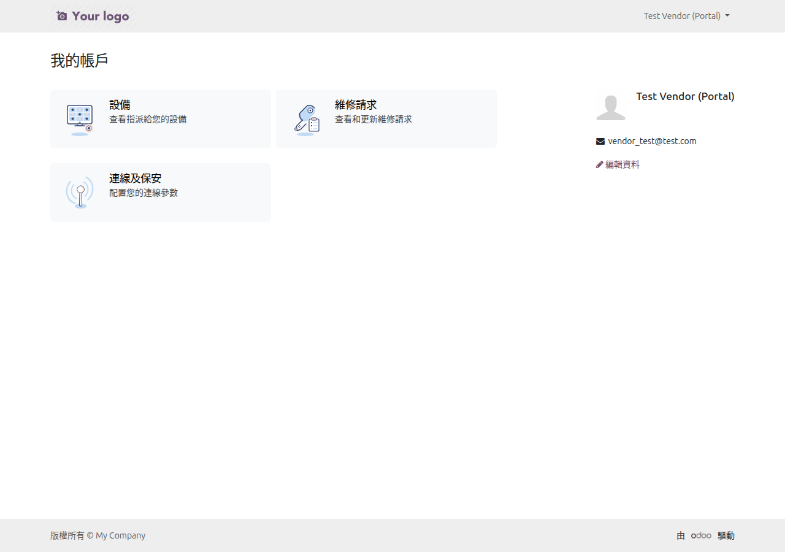
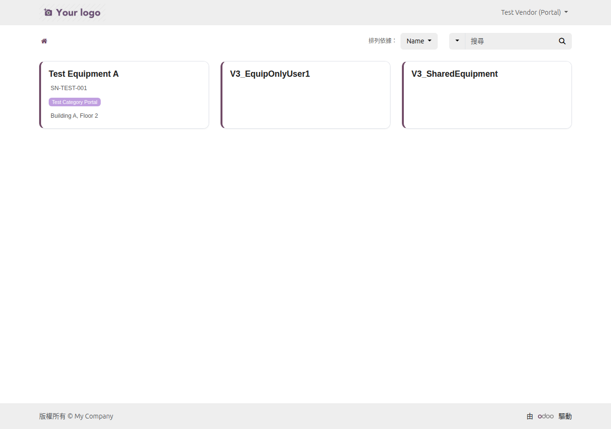
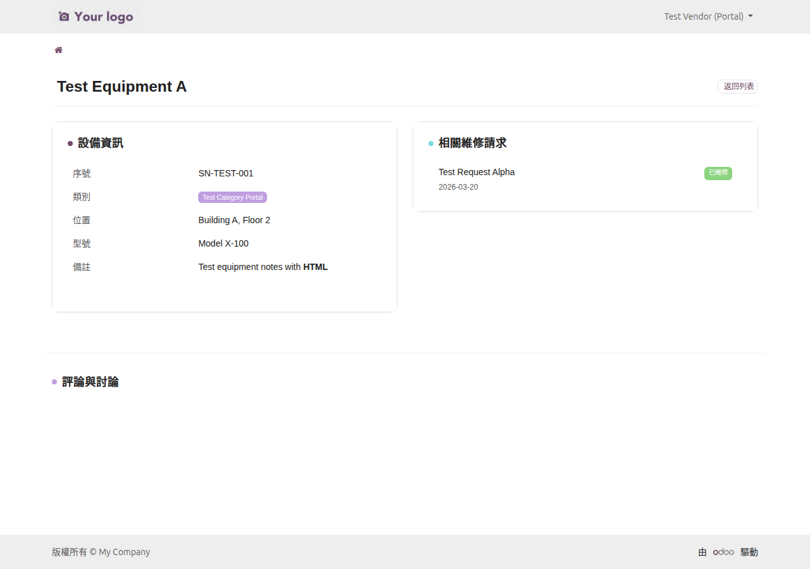
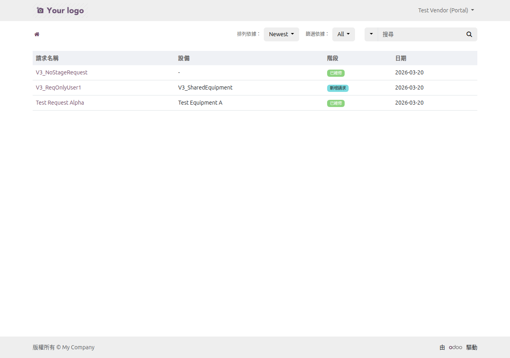
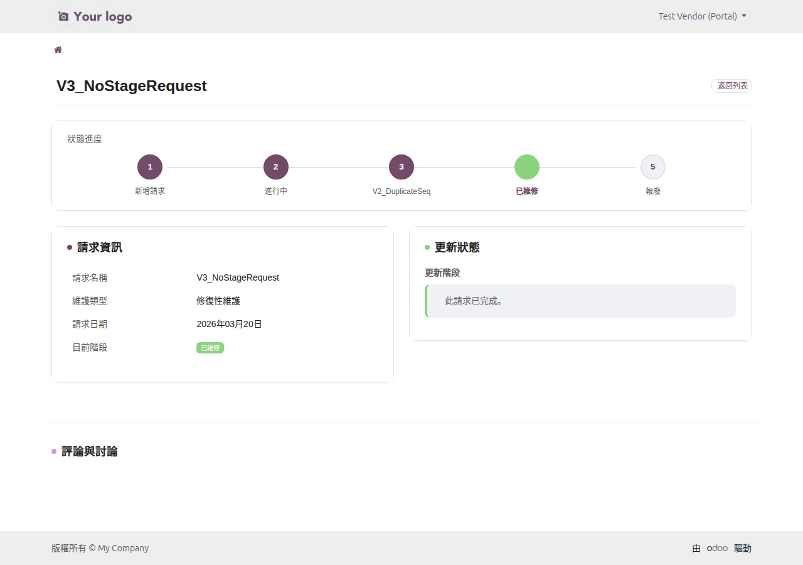
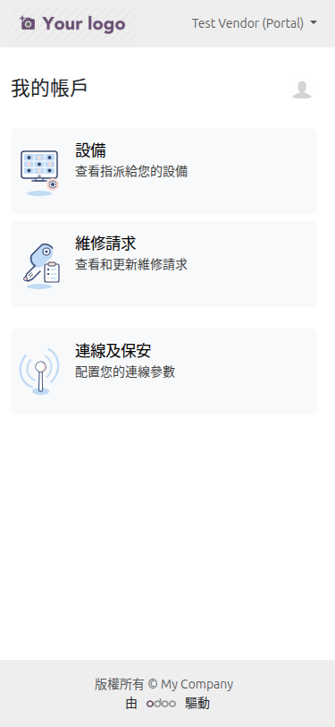
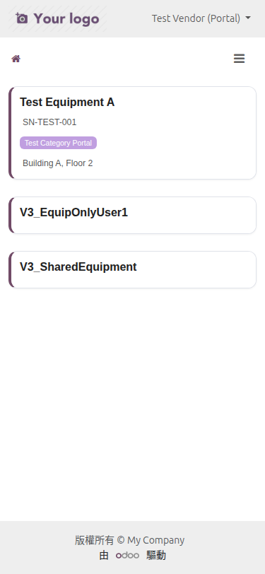
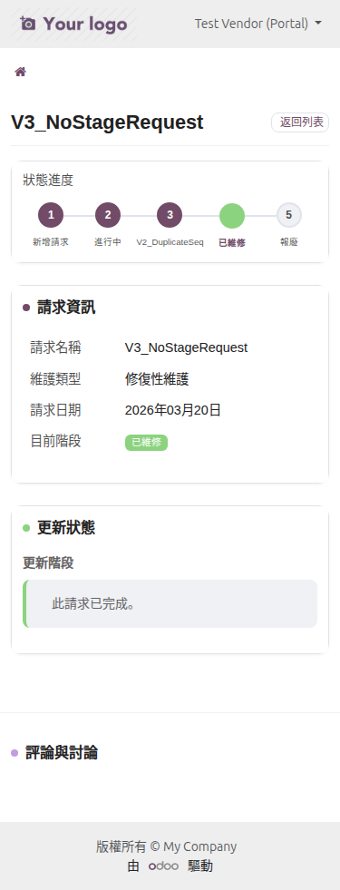

<p align="center">
  
</p>

<h1 align="center">Odoo 18 Maintenance Portal</h1>

<p align="center">
  <strong>Odoo 18 外部廠商維修保養入口網站模組</strong><br/>
  讓外部維修廠商通過 Portal 入口查看設備、追蹤維修單、更新工作狀態
</p>

<p align="center">
  <a href="#功能特色">功能特色</a> &bull;
  <a href="#系統架構">系統架構</a> &bull;
  <a href="#安裝說明">安裝說明</a> &bull;
  <a href="#功能截圖">功能截圖</a> &bull;
  <a href="#設定指南">設定指南</a> &bull;
  <a href="#技術細節">技術細節</a> &bull;
  <a href="README_EN.md">English</a>
</p>

<p align="center">
  
  
  
  
  
</p>

---

## 概述

**Maintenance Portal** 是為 Odoo 18 打造的維修保養入口網站模組，將 Odoo 原生的設備維護功能延伸到 Portal 前台，讓外部廠商（Portal 使用者）能直接在網頁上查看被指派的設備、追蹤維修請求進度、並更新工作狀態。

<p align="center">
  
</p>

### 為什麼需要此模組？

| 問題痛點 | 解決方案 |
|----------|----------|
| 外部廠商無法查看指派的設備資訊 | Portal 入口直接查看設備清單與詳細資料 |
| 維修進度需要電話/郵件來回確認 | 廠商自行在 Portal 更新維修狀態 |
| 沒有響應式的行動裝置支援 | 完整 RWD 設計，手機/平板/桌面都能使用 |
| 系統只有英文介面 | 內建繁體中文翻譯，雙語支援 |
| Portal 頁面風格與 Odoo 原生不一致 | 完全遵循 Odoo 18 原生設計語言，無違和感 |

---

## 功能特色

### 設備管理 Portal

- **設備清單** — 查看所有被指派的設備，支援搜尋（名稱/序號/分類）與排序
- **設備詳情** — 完整設備資料：名稱、序號、分類、指派日期、技術規格
- **關聯維修單** — 設備詳情頁直接顯示該設備的所有維修請求
- **卡片式佈局** — 設備以卡片形式呈現，點擊整張卡片即可進入詳情

### 維修請求 Portal

- **維修單清單** — 查看所有指派的維修請求，支援搜尋、排序、階段篩選
- **維修單詳情** — 完整維修資訊：設備、優先級、階段、排程日期、描述
- **狀態更新** — 廠商可直接在 Portal 上更新維修狀態（開始工作 / 標記完成）
- **Portal Chatter** — 維修單詳情頁內建留言討論區（依賴 Odoo 原生 mail 模組）

### 視覺設計

- **Odoo 原生風格** — 完全遵循 Odoo 18 Portal 設計語言，使用原生紫色主題 (#714B67)
- **響應式設計 (RWD)** — 完美適配桌面 (1280px+)、平板 (768px)、手機 (375px)
- **原生卡片系統** — Portal 首頁卡片使用 `portal.portal_docs_entry` 原生模板，與「連線及保安」等原生卡片完全一致
- **64x64 插畫圖示** — SVG 圖示採用 Odoo 原生插畫風格（#C1DBF6 / #FBDBD0 / #374874 配色）
- **CSS 模組化** — 所有自訂 CSS 均限定作用域在模組頁面，不污染登入頁和首頁的原生主題

### 安全機制

- **存取控制** — Portal 使用者只能查看被指派 (`portal_user_ids`) 的設備和維修單
- **文件權限檢查** — 每次存取都通過 `_document_check_access` 驗證
- **SQL 注入防護** — 搜尋輸入自動跳脫 SQL LIKE 萬用字元
- **CSRF 保護** — 所有 POST 請求都啟用 CSRF Token 驗證
- **Odoo ACL** — 遵循 Odoo 原生的 `ir.model.access` 權限控制

### 國際化

- **繁體中文** — 完整的 `zh_TW.po` 翻譯檔案
- **英文** — 預設英文介面
- **翻譯模板** — 提供 `.pot` 模板供擴充其他語言

---

## 系統架構

```
┌─────────────────────────────────────────────────────────┐
│                  Maintenance Portal                      │
├─────────────────────────────────────────────────────────┤
│                                                          │
│  ┌────────────────────────────────────────────────────┐  │
│  │              Portal 前台 (Frontend)                 │  │
│  │                                                    │  │
│  │  /my/home                Portal 首頁卡片           │  │
│  │  /my/equipments          設備清單（搜尋/排序/分頁）│  │
│  │  /my/equipments/<id>     設備詳情 + 關聯維修單     │  │
│  │  /my/maintenance-requests     維修單清單           │  │
│  │  /my/maintenance-requests/<id>  維修單詳情 + 操作  │  │
│  │                                                    │  │
│  └───────────────────────┬────────────────────────────┘  │
│                          │                               │
│  ┌───────────────────────▼────────────────────────────┐  │
│  │           Controllers (portal.py)                  │  │
│  │                                                    │  │
│  │  MaintenancePortal(CustomerPortal)                 │  │
│  │  ├── _prepare_home_portal_values()  計數器         │  │
│  │  ├── portal_my_equipments()         設備清單       │  │
│  │  ├── portal_equipment_detail()      設備詳情       │  │
│  │  ├── portal_my_maintenance_requests() 維修單清單   │  │
│  │  ├── portal_maintenance_request_detail() 詳情      │  │
│  │  ├── portal_maintenance_request_update() 狀態更新  │  │
│  │  └── _document_check_access()       權限驗證       │  │
│  └───────────────────────┬────────────────────────────┘  │
│                          │                               │
│  ┌───────────────────────▼────────────────────────────┐  │
│  │              Models (ORM)                          │  │
│  │                                                    │  │
│  │  maintenance.equipment (繼承)                      │  │
│  │  └── portal_user_ids: Many2many(res.users)        │  │
│  │                                                    │  │
│  │  maintenance.request (繼承)                        │  │
│  │  ├── portal_user_ids: Many2many(res.users)        │  │
│  │  ├── action_portal_set_in_progress()              │  │
│  │  └── action_portal_set_done()                     │  │
│  └───────────────────────┬────────────────────────────┘  │
│                          │                               │
├──────────────────────────┼──────────────────────────────┤
│                          ▼                               │
│  ┌──────────────────────────────────────────────────┐   │
│  │              Odoo 18 Framework                    │   │
│  │  maintenance │ portal │ mail │ base               │   │
│  └──────────────────────────────────────────────────┘   │
│                          │                               │
│  ┌──────────────────────────────────────────────────┐   │
│  │              PostgreSQL                           │   │
│  └──────────────────────────────────────────────────┘   │
└─────────────────────────────────────────────────────────┘
```

### 模組依賴

```
maintenance_portal
    ├── maintenance    (Odoo 原生設備維護模組)
    └── portal         (Odoo 原生 Portal 框架)
         └── mail      (Chatter 留言系統)
```

---

## 功能截圖

### Portal 首頁 — 設備與維修卡片

Portal 首頁顯示「設備」與「維修請求」卡片，使用 Odoo 原生 `portal.portal_docs_entry` 模板，與「連線及保安」等原生卡片風格完全一致。

<p align="center">
  
</p>

### 設備清單

以卡片形式展示所有被指派的設備，支援按名稱、序號、分類搜尋與排序。

<p align="center">
  
</p>

### 設備詳情

完整的設備資訊頁面，包含基本資料、技術規格、以及關聯的維修請求清單。

<p align="center">
  
</p>

### 維修請求清單

列出所有被指派的維修請求，支援按階段篩選、搜尋和排序。

<p align="center">
  
</p>

### 維修請求詳情

維修請求的完整資訊頁面，包含設備資訊、優先級、排程日期、描述說明，以及狀態更新操作按鈕。

<p align="center">
  
</p>

### 響應式設計 — 手機版

所有頁面均完美適配手機螢幕，卡片和表格自動調整佈局。

<p align="center">
  
  &nbsp;&nbsp;
  
  &nbsp;&nbsp;
  
</p>

---

## 安裝說明

### 環境需求

- **Odoo 18.0**（社區版或企業版）
- **Python 3.10+**
- **PostgreSQL 13+**

### 方法一：直接安裝

```bash
# 1. Clone 此倉庫到 Odoo addons 目錄
git clone https://github.com/WOOWTECH/Odoo_maintanence_enhance.git

# 2. 將模組複製到 addons 路徑
cp -r Odoo_maintanence_enhance/maintenance_portal /path/to/odoo/addons/

# 3. 更新模組列表並安裝
odoo -u maintenance_portal -d your_database --stop-after-init
```

### 方法二：Docker / Podman 部署

```bash
# 1. 將模組放入 addons bind mount 目錄
cp -r maintenance_portal /path/to/docker/addons/

# 2. 在容器中升級模組
docker exec <container> odoo -u maintenance_portal -d <database> --stop-after-init

# 3. 重啟容器
docker restart <container>
```

### 在 Odoo 中安裝

1. 進入 **應用程式** 選單
2. 點擊 **更新應用程式清單**
3. 搜尋「Maintenance Portal」
4. 點擊安裝

---

## 設定指南

### 1. 指派設備給外部廠商

1. 進入 **維護 > 設備**
2. 開啟設備記錄
3. 在 **Portal 使用者** 欄位中新增外部廠商的 Portal 帳號

### 2. 指派維修請求給外部廠商

1. 進入 **維護 > 維修請求**
2. 開啟維修請求記錄
3. 在 **Portal 使用者** 欄位中新增外部廠商

### 3. 廠商 Portal 使用流程

1. 外部廠商使用 Portal 帳號登入 `/web/login`
2. 在「我的帳戶」首頁看到「設備」和「維修請求」卡片
3. 點擊進入設備清單或維修單清單
4. 查看詳情、更新維修狀態

---

## 技術細節

### 目錄結構

```
maintenance_portal/
├── controllers/
│   ├── __init__.py
│   └── portal.py                   # Portal 控制器（6 個路由）
├── docs/
│   ├── plans/
│   │   └── 2026-03-23-woowtech-brand-portal-redesign.md
│   └── screenshots/                # 功能截圖
├── i18n/
│   ├── maintenance_portal.pot      # 翻譯模板
│   └── zh_TW.po                    # 繁體中文翻譯
├── models/
│   ├── __init__.py
│   ├── maintenance_equipment.py    # 設備模型擴展
│   └── maintenance_request.py      # 維修請求模型擴展
├── security/
│   ├── ir.model.access.csv         # ACL 存取控制
│   └── maintenance_portal_security.xml  # 安全規則
├── static/
│   └── src/
│       ├── css/
│       │   └── portal.css          # 模組專用 CSS（紫色主題 + RWD）
│       └── img/
│           ├── equipment.svg       # 設備圖示（64x64 插畫風格）
│           └── maintenance.svg     # 維修圖示（64x64 插畫風格）
├── tests/
│   ├── test_portal_v1.py           # V1 單元測試（103 項）
│   ├── test_portal_v2.py           # V2 整合測試（56 項）
│   └── test_portal_v3.py           # V3 視覺/RWD 測試（80 項）
├── views/
│   ├── maintenance_equipment_views.xml  # 後台設備視圖擴展
│   ├── maintenance_request_views.xml    # 後台維修請求視圖擴展
│   └── portal_templates.xml        # Portal 前台模板（QWeb）
├── __init__.py
├── __manifest__.py
├── README.md                       # 中文 README
└── README_EN.md                    # English README
```

### Portal 路由一覽

| 路由 | 方法 | 說明 |
|------|------|------|
| `/my/equipments` | GET | 設備清單（搜尋/排序/分頁） |
| `/my/equipments/<id>` | GET | 設備詳情 |
| `/my/maintenance-requests` | GET | 維修請求清單（搜尋/排序/篩選/分頁） |
| `/my/maintenance-requests/<id>` | GET | 維修請求詳情 |
| `/my/maintenance-requests/<id>/update` | POST | 更新維修狀態 |

### CSS 設計原則

- **不覆蓋原生主題** — 登入頁和 Portal 首頁保持 Odoo 原生紫色，不受模組影響
- **作用域限定** — 所有 CSS 選擇器限定在 `.maintenance-detail-card`、`.maintenance-equipment-card` 等模組專用 class 內
- **CSS 自訂屬性** — 使用 `--wt-primary: #714B67` 等變數統一管理品牌色彩
- **響應式斷點** — 針對 `max-width: 767px` 和 `max-width: 575px` 進行行動裝置優化

### 測試覆蓋

| 測試套件 | 測試數量 | 通過 | 失敗 | 覆蓋範圍 |
|----------|----------|------|------|----------|
| V1 單元測試 | 103 | 103 | 0 | 模型、控制器、權限 |
| V2 整合測試 | 56 | 56 | 0 (1 預期) | Portal 流程、搜尋/排序/篩選 |
| V3 視覺測試 | 80 | 80 | 0 (9 警告) | RWD、CSS 作用域、原生相容性 |
| **合計** | **239** | **239** | **0** | |

---

## 更新日誌

### v18.0.1.0.0 (2026-04)

- **初始版本** — 完整的維修保養 Portal 入口模組
- **設備管理** — Portal 設備清單、詳情頁、搜尋與排序
- **維修請求** — Portal 維修單清單、詳情頁、狀態更新工作流
- **Odoo 原生風格** — 使用 `portal.portal_docs_entry` 模板、64x64 插畫圖示
- **CSS 模組化** — 紫色主題跟隨 Odoo 原生，CSS 不污染原生頁面
- **RWD** — 完整響應式設計（桌面/平板/手機）
- **繁體中文** — 完整 `zh_TW` 翻譯
- **測試** — V1/V2/V3 三階段測試，共 239 項全部通過

---

## 授權

本專案採用 **LGPL-3** 授權條款。

---

## 支援

- **公司:** [WoowTech](https://www.woowtech.com)
- **問題回報:** [GitHub Issues](https://github.com/WOOWTECH/Odoo_maintanence_enhance/issues)

---

<p align="center">
  <sub>Built with care by <a href="https://github.com/WOOWTECH">WOOWTECH</a> &bull; Powered by Odoo 18</sub>
</p>
